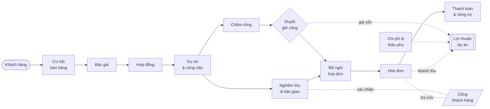
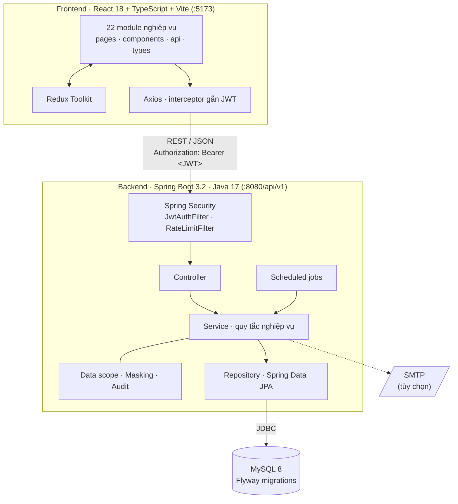

<div align="center">

# Vận Hành Dịch Vụ

### Nền tảng quản trị vận hành dành cho doanh nghiệp dịch vụ chuyên nghiệp

**Từ cơ hội bán hàng tới hóa đơn và lợi nhuận thực của từng dự án, trên cùng một nguồn dữ liệu.**

[](https://adoptium.net/)
[](https://spring.io/projects/spring-boot)
[](https://dev.mysql.com/)
[](backend/src/main/resources/db/migration)
[](https://react.dev/)
[](https://www.typescriptlang.org/)
[](https://vitejs.dev/)
[](#kiểm-thử)
[](#)

[Tính năng](#tính-năng) · [Bắt đầu nhanh](#bắt-đầu-nhanh) · [Kiến trúc](#kiến-trúc) · [API](#api) · [Triển khai](#triển-khai) · [Tài liệu](#tài-liệu)

</div>

---

## Tổng quan

**Vận Hành Dịch Vụ** (Service Operations) là hệ thống quản trị vận hành cho các công ty cung cấp dịch vụ theo dự án:
phát triển phần mềm, tư vấn giải pháp, kiểm thử, bảo trì. Hệ thống phủ trọn chuỗi giá trị của một hợp đồng dịch vụ:
**tìm khách, chốt hợp đồng, triển khai, ghi giờ công, nghiệm thu, xuất hóa đơn, thu tiền và đo lợi nhuận**.

Khi các bước này nằm rải rác trên CRM, bảng tính chấm công và phần mềm kế toán, doanh nghiệp thường gặp bốn vấn đề mà
Vận Hành Dịch Vụ được thiết kế để xử lý:

| Vấn đề thường gặp | Cách hệ thống giải quyết |
|---|---|
| Giờ công đã làm nhưng quên tính tiền, hoặc tính sai đơn giá | Hóa đơn được đề xuất trực tiếp từ giờ công đã duyệt. Đơn giá tự tra theo hợp đồng, cấp bậc, loại công việc và ngày hiệu lực |
| Chỉ biết dự án lỗ khi đã quyết toán | Biên lợi nhuận tính gần như theo thời gian thực từ giờ công, chi phí và thầu phụ; vượt ngưỡng thì cảnh báo |
| Số liệu lương và giá vốn lộ ra cho người không có phận sự | Phân quyền theo vai trò **và** theo cây tổ chức; trường nhạy cảm tự động bị che, mọi lượt truy cập đều được ghi nhật ký |
| Khách hàng phải gọi điện hỏi tiến độ, công nợ | Cổng khách hàng riêng: xem dự án, xác nhận nghiệm thu, tra cứu hóa đơn |

<div align="center">

| **15** | **9** | **76** | **81** | **2.300+** |
|:---:|:---:|:---:|:---:|:---:|
| phân hệ nghiệp vụ | vai trò người dùng | REST controller | màn hình | test tự động |

</div>

## Luồng nghiệp vụ xuyên suốt



Mỗi mũi tên là một bước chuyển dữ liệu do hệ thống thực hiện: tạo hợp đồng từ cơ hội, tạo dự án từ hợp đồng, sinh
đề nghị hóa đơn từ giờ công đã duyệt, đẩy doanh thu và giá vốn sang báo cáo lợi nhuận. Không ai phải nhập lại.

## Tính năng

Hệ thống gồm 15 phân hệ (mã Epic `NCL-01` → `NCL-15`), chia thành năm nhóm.

### Kinh doanh

<details>
<summary><b>Khách hàng</b> · <code>NCL-02</code></summary>

- Hồ sơ khách hàng và danh bạ người liên hệ.
- **Gộp hồ sơ khách hàng trùng lặp**: toàn bộ dữ liệu liên quan chuyển về hồ sơ được giữ lại, kèm nhật ký lần gộp.
- Phạm vi xem dữ liệu theo người phụ trách và phòng ban.

</details>

<details>
<summary><b>Cơ hội bán hàng và báo giá</b> · <code>NCL-03</code></summary>

- Quản lý cơ hội theo giai đoạn, ghi nhận **hoạt động chăm sóc** (gọi điện, gặp mặt, email).
- **Báo giá** theo hạng mục, vai trò và cấp bậc nhân sự; lấy giá từ danh mục dịch vụ.
- **Báo cáo đường ống bán hàng** theo giai đoạn và **dự báo doanh thu** theo xác suất thắng.
- Đóng cơ hội (thắng/thua) và tạo hợp đồng trực tiếp từ cơ hội đã thắng.

</details>

<details>
<summary><b>Hợp đồng</b> · <code>NCL-04</code></summary>

- Bốn loại hợp đồng: theo thời gian và vật tư (`TIME_AND_MATERIAL`), trọn gói (`FIXED_PRICE`), bảo trì định kỳ
  (`MAINTENANCE`), theo mốc (`MILESTONE`).
- Mốc thanh toán, phụ lục hợp đồng, gia hạn và tái ký.
- **Chặn xuất hóa đơn khi tổng lũy kế vượt giá trị hợp đồng** (phải lập phụ lục điều chỉnh trước), nhắc hợp đồng
  sắp hết hạn.
- Tạo dự án trực tiếp từ hợp đồng.

</details>

### Triển khai

<details>
<summary><b>Dự án và công việc</b> · <code>NCL-05</code></summary>

- Cấu trúc phân rã công việc (WBS): gói công việc, công việc, giao việc, ngân sách giờ cho từng công việc.
- Mốc dự án, sổ đăng ký rủi ro, **tạo dự án từ mẫu**.
- Cảnh báo tự động khi công việc **vượt ngân sách giờ công**.
- Trang **"Việc của tôi"** gom mọi công việc được giao cho từng nhân viên.

</details>

<details>
<summary><b>Chấm công</b> · <code>NCL-06</code></summary>

- Bảng chấm công theo tuần, ghi giờ theo công việc; **đồng hồ bấm giờ** ngay trên giao diện.
- Quy trình nộp, duyệt, từ chối. Giờ công đã duyệt **không sửa trực tiếp được**: mọi thay đổi đi qua phiếu điều chỉnh
  (bút toán đảo) để giữ dấu vết kiểm toán.
- **Khóa kỳ chấm công** sau khi chốt số liệu, danh sách nhân viên chưa nộp, nhắc nộp tự động.
- Chặn ghi quá 12 giờ trong một ngày, ghi cho ngày tương lai hoặc cho dự án đã đóng.

</details>

<details>
<summary><b>Nghiệm thu và bàn giao</b> · <code>NCL-12</code></summary>

- Phiếu nghiệm thu gắn với mốc hợp đồng. Phiếu được khách hàng xác nhận thì mốc đủ điều kiện xuất hóa đơn.
- Quản lý **sản phẩm bàn giao theo phiên bản**, lịch sử nộp lại và phản hồi.

</details>

### Tài chính

<details>
<summary><b>Đơn giá</b> · <code>NCL-07</code></summary>

- **Bảng giá bán chung** theo vai trò chuyên môn và cấp bậc, **đơn giá riêng theo hợp đồng** (ưu tiên hơn giá chung).
- **Hệ số theo loại công việc**: bình thường ×1,0 · ngoài giờ ×1,5 · cuối tuần ×2,0 · ngày lễ ×3,0.
- **Chi phí giờ công nội bộ** của từng nhân viên (dữ liệu nhạy cảm).
- Mọi mức giá đều **có ngày hiệu lực**: đổi giá không làm sai số liệu quá khứ. Có công cụ tra cứu đơn giá áp dụng
  cho một dòng giờ công bất kỳ và lịch sử thay đổi giá.

</details>

<details>
<summary><b>Chi phí dự án</b> · <code>NCL-08</code></summary>

- Phiếu chi phí dự án và chi phí thầu phụ, quy trình duyệt của kế toán.
- Đánh dấu chi phí **tính lại cho khách hàng** để đưa vào hóa đơn.
- **Phân bổ chi phí chung** xuống các dự án.

</details>

<details>
<summary><b>Lợi nhuận dự án</b> · <code>NCL-09</code></summary>

- Giá vốn nhân công, doanh thu ghi nhận, **biên lợi nhuận gộp** của từng dự án.
- Phân tích biên lợi nhuận theo khách hàng và theo nhân viên.
- So sánh **kế hoạch (từ báo giá) và thực tế**, dự báo lợi nhuận đến khi kết thúc dự án.
- **Ngưỡng cảnh báo** biên lợi nhuận cấu hình được.

</details>

<details>
<summary><b>Hóa đơn và thanh toán</b> · <code>NCL-10</code></summary>

- **Đề nghị hóa đơn tự động** từ giờ công đã duyệt và chi phí tính lại cho khách hàng. Dòng nào đã vào hóa đơn thì
  không bị tính hai lần.
- Hóa đơn theo mốc nghiệm thu; **hóa đơn định kỳ** tự sinh cho hợp đồng bảo trì.
- Ghi nhận thanh toán từng phần, **báo cáo tuổi nợ phải thu**, **nhắc nợ quá hạn** tự động.

</details>

### Phân tích và tương tác

<details>
<summary><b>Báo cáo và bảng điều khiển</b> · <code>NCL-11</code></summary>

- Bảng điều khiển các chỉ số KPI chính.
- Báo cáo doanh thu, hiệu quả dự án, chấm công, **hiệu suất sử dụng nhân sự** (utilization), đường ống bán hàng.
- Xuất báo cáo CSV (UTF-8 có BOM, mở đúng tiếng Việt trong Excel). Cột nhạy cảm tự bị loại theo quyền người xuất.

</details>

<details>
<summary><b>Cổng khách hàng</b> · <code>NCL-13</code></summary>

- Tài khoản riêng cho người liên hệ của khách hàng, do quản trị viên cấp và khóa/mở.
- Khách hàng xem tiến độ dự án, **xác nhận hoặc từ chối phiếu nghiệm thu** (bắt buộc nêu lý do khi từ chối), tra cứu
  hóa đơn và công nợ.
- Cách ly dữ liệu tuyệt đối: tài khoản cổng không gọi được API nội bộ và không thấy bản ghi của khách hàng khác.

</details>

<details>
<summary><b>Thông báo</b> · <code>NCL-14</code></summary>

- Thông báo trong ứng dụng cho mọi sự kiện nghiệp vụ quan trọng (bảng chấm công chờ duyệt, vượt ngân sách, hóa đơn
  quá hạn...).
- Mỗi người tự chọn nhận **ngay lập tức** hay **gom thành bản tổng hợp cuối ngày**.
- **Chống gửi trùng** theo đợt cảnh báo, thời gian chờ cấu hình được theo từng loại sự kiện.

</details>

### Nền tảng và quản trị

<details>
<summary><b>Đăng nhập và phân quyền</b> · <code>NCL-01</code></summary>

- Đăng nhập JWT, **xác thực hai bước TOTP** (Google Authenticator, Microsoft Authenticator...).
- Tạm khóa sau 5 lần nhập sai mật khẩu, tự đăng xuất khi không thao tác, khôi phục mật khẩu bằng mã 6 số có hạn 10 phút.
- **Cây tổ chức** bốn tầng (Trung tâm, Ban, Phòng, Tổ/Nhóm), hồ sơ nhân sự, hợp đồng lao động, lịch ngày lễ.
- Gán vai trò kèm **phạm vi dữ liệu** (`COMPANY`, `DEPARTMENT`, `SELF`).
- Che dữ liệu lương và giá vốn, nhật ký truy cập dữ liệu nhạy cảm.

</details>

<details>
<summary><b>Quản trị hệ thống</b> · <code>NCL-15</code></summary>

- **Danh mục dịch vụ** kèm lịch sử giá theo ngày hiệu lực.
- Thông tin công ty và **kỳ tài chính**.
- **Sao lưu và phục hồi** dữ liệu: sao lưu thủ công hoặc theo lịch, kiểm tra checksum. Phục hồi đi qua hai bước xác
  nhận (mã xác nhận có hạn và mật khẩu).
- **Nhập dữ liệu từ tệp CSV** có xem trước, phát hiện dòng trùng và chọn bỏ qua hoặc cập nhật.
- Nhật ký thao tác toàn hệ thống.

</details>

<details>
<summary><b>Trải nghiệm người dùng</b></summary>

- Giao diện tiếng Việt, thiết kế cho cả máy tính văn phòng lẫn điện thoại ngoài hiện trường.
- **Bảng lệnh** <kbd>Ctrl</kbd> + <kbd>K</kbd> (<kbd>⌘</kbd> + <kbd>K</kbd> trên macOS) để nhảy nhanh tới bất kỳ
  màn hình nào.
- Menu tự ẩn các chức năng người dùng không có quyền.
- Hệ thống thiết kế riêng, mô tả đầy đủ trong [DESIGN.md](DESIGN.md).

</details>

### Tác vụ tự động

| Lịch chạy | Tác vụ |
|---|---|
| Mỗi 30 phút | Hủy đồng hồ bấm giờ bị quên chạy quá 12 giờ và nhắc người dùng nhập tay |
| Phút thứ 5 mỗi giờ | Rà soát công việc vượt ngân sách giờ công, báo cho quản lý dự án |
| 06:00 hằng ngày | Sinh hóa đơn định kỳ cho hợp đồng bảo trì |
| 07:00 hằng ngày | Nhắc nợ hóa đơn quá hạn |
| 20:00 hằng ngày | Gửi bản tổng hợp thông báo trong ngày |
| 20:00 Chủ nhật | Nhắc nhân viên nộp bảng chấm công tuần |
| Theo `BACKUP_CRON` | Sao lưu dữ liệu tự động (mặc định tắt) |

## Vai trò và phân quyền

| Mã | Vai trò | Trách nhiệm chính |
|---|---|---|
| `VT-01` | Ban giám đốc | Theo dõi sức khỏe tài chính và năng lực toàn công ty |
| `VT-02` | Quản lý dự án | Chia việc, giao việc, duyệt chấm công, nghiệm thu, đề nghị xuất hóa đơn |
| `VT-03` | Nhân viên chuyên môn | Thực hiện công việc và ghi giờ công của chính mình |
| `VT-04` | Nhân viên kinh doanh | Tìm khách hàng, theo đuổi cơ hội, lập báo giá |
| `VT-05` | Kế toán | Hợp đồng, hóa đơn, thanh toán, duyệt chi phí, đối chiếu lợi nhuận |
| `VT-06` | Nhân sự | Hồ sơ nhân sự, hợp đồng lao động, ngày lễ, chi phí giờ công nội bộ |
| `VT-07` | Quản trị viên | Tài khoản, cây tổ chức, phân quyền, cấu hình, sao lưu, nhật ký |
| `VT-08` | Nhân viên công ty | Tên gọi chung cho chức năng dùng chung, không phải vai trò cấp quyền |
| `VT-09` | Khách hàng | Chỉ truy cập cổng khách hàng, chỉ thấy dữ liệu của chính mình |

Quyền được xác định trên **hai trục độc lập**:

1. **Vai trò** quyết định *được làm gì*. Kiểm tra bằng `@PreAuthorize` ở từng endpoint.
2. **Phạm vi dữ liệu** quyết định *được thấy bản ghi nào*: toàn công ty (`COMPANY`), một nhánh của cây tổ chức kèm các
   đơn vị con (`DEPARTMENT`), hoặc chỉ bản ghi của chính mình (`SELF`).

Ví dụ: hai quản lý dự án cùng vai trò `VT-02` nhưng một người phạm vi `COMPANY` giám sát mọi dự án, người kia phạm vi
`SELF` chỉ thấy dự án mình phụ trách.

## Bảo mật

| Lớp | Cơ chế |
|---|---|
| Xác thực | JWT không trạng thái, mật khẩu băm BCrypt, xác thực hai bước TOTP |
| Chống dò mật khẩu | Tạm khóa tài khoản sau 5 lần sai; giới hạn tần suất nhập mã hai bước; giới hạn yêu cầu khôi phục mật khẩu theo cả IP lẫn email |
| Phân quyền | `@PreAuthorize` theo vai trò, lọc phạm vi dữ liệu theo cây tổ chức, kiểm tra quyền sở hữu bản ghi |
| Che dữ liệu | Trường gắn `@MaskSensitive` tự trả về `***` khi serialize nếu người xem không thuộc `VT-01`, `VT-05`, `VT-06` |
| Kiểm toán | Nhật ký thao tác, nhật ký truy cập dữ liệu nhạy cảm, ghi lại mọi lần bị từ chối quyền (HTTP 403) |
| Cách ly cổng khách hàng | Tài khoản cổng bị chặn khỏi API nội bộ; bản ghi không thuộc về khách hàng trả 403 (không trả 404) để không dò được mã |
| Cấu hình production | Profile `prod` không nạp dữ liệu demo, không có giá trị mặc định cho thông tin kết nối và **dừng khởi động nếu thiếu cấu hình gửi thư** |

Chi tiết cơ chế che dữ liệu: [docs/02-architecture/data-scope-and-masking.md](docs/02-architecture/data-scope-and-masking.md).

## Kiến trúc

Ứng dụng tách hai tầng: frontend SPA độc lập giao tiếp với backend hoàn toàn qua REST API.



**Nguyên tắc thiết kế**

- **Modular monolith.** Backend chia theo miền nghiệp vụ trong `com.serviceops.modules.*`. Mỗi module tự chứa
  `controller`, `service` (interface và `impl`), `repository`, `entity`, `dto`, `mapper`.
- **Phân tầng nghiêm ngặt.** `Controller → Service → Repository`, không nhảy tầng. Controller không chứa quy tắc
  nghiệp vụ; API chỉ nhận và trả DTO, chuyển đổi qua lớp `mapper` của từng module.
- **Schema là mã nguồn.** Mọi thay đổi cơ sở dữ liệu là một migration Flyway mới; Hibernate chỉ `validate`, không tự
  sửa schema.
- **Tiền tệ chính xác.** Toàn bộ số tiền dùng `BigDecimal` với quy tắc làm tròn tường minh, không dùng số thực.
- **Dữ liệu theo ngày hiệu lực.** Đơn giá, chi phí giờ công và giá dịch vụ đều lưu theo mốc hiệu lực, nên số liệu
  quá khứ luôn tái tạo được.
- **Frontend theo tính năng.** Mỗi module trong `frontend/src/modules` tự quản lý `pages`, `components`, `api`,
  `types`.
- **Lỗi và response thống nhất.** Mọi exception đi qua `GlobalExceptionHandler`, trả về cùng một khuôn dạng kèm
  `errorCode` ổn định.

<details>
<summary><b>Ví dụ quy tắc nghiệp vụ: cách tính tiền một dòng giờ công</b></summary>

```
Đơn giá ngày  = đơn giá theo hợp đồng (nếu có) hoặc bảng giá chung
                · tra theo vai trò chuyên môn + cấp bậc, hiệu lực tại ngày làm việc
Đơn giá giờ   = Đơn giá ngày × Hệ số loại công việc ÷ 8
Thành tiền    = Số giờ × Đơn giá giờ

Giá vốn       = Số giờ × Chi phí giờ công nội bộ của nhân viên (hiệu lực tại ngày làm việc)
Biên lợi nhuận = (Doanh thu ghi nhận − Tổng giá vốn) ÷ Doanh thu ghi nhận
                 · Tổng giá vốn = nhân công + chi phí dự án + thầu phụ
```

Chỉ giờ công **đã duyệt** và **có tính phí** mới vào hóa đơn. Mỗi dòng giờ công chỉ vào một đề nghị hóa đơn.

</details>

## Công nghệ

| Tầng | Công nghệ |
|---|---|
| **Backend** | Java 17 · Spring Boot 3.2.5 (Web, Security, Data JPA, Validation, Mail) · Hibernate · Lombok |
| **Bảo mật** | Spring Security · JJWT 0.12 · TOTP · BCrypt |
| **Cơ sở dữ liệu** | MySQL 8.0 · Flyway (92 migration và bộ dữ liệu nền dạng repeatable) |
| **Tài liệu API** | springdoc-openapi 2.5 (Swagger UI) |
| **Frontend** | React 18.3 · TypeScript 5.4 · Vite 5 · Redux Toolkit 2 · React Router 6 · Axios |
| **Giao diện** | Hệ thống thiết kế riêng ([DESIGN.md](DESIGN.md)) · Manrope · Phosphor Icons |
| **Kiểm thử** | JUnit 5 · Mockito · Spring Security Test · H2 · Vitest · Testing Library · Playwright |
| **Hạ tầng** | Docker · Docker Compose · Nginx · Render · Railway |

## Cấu trúc thư mục

```text
service-operations/
├── backend/                              Spring Boot · Java 17
│   ├── src/main/java/com/serviceops/
│   │   ├── modules/                      Miền nghiệp vụ
│   │   │   ├── identity/                 Xác thực · 2FA · người dùng · vai trò · tổ chức · nhân sự
│   │   │   ├── customer/  opportunity/  quotation/  contract/
│   │   │   ├── project/   timesheet/    acceptance/
│   │   │   ├── rate/      expense/      profitability/  invoice/
│   │   │   ├── report/    portal/       notification/   admin/
│   │   ├── common/                       api · audit · masking · scope · exception · validation
│   │   ├── security/                     JWT · rate limit · TOTP · phân quyền
│   │   ├── scheduler/                    Tác vụ định kỳ dùng chung
│   │   └── config/
│   ├── src/main/resources/
│   │   ├── db/migration/                 V1 … V92 (Flyway)
│   │   ├── db/seed/                      R__seed_*.sql, dữ liệu nền (chỉ profile dev)
│   │   └── application{,-dev,-prod,-test}.yml
│   └── src/test/                         Unit test và integration test (*IT)
│
├── frontend/                             React · TypeScript · Vite
│   ├── src/
│   │   ├── modules/                      22 module tính năng
│   │   ├── components/  layouts/  routers/
│   │   ├── stores/  hooks/  configs/  constants/  i18n/
│   │   └── assets/styles/                CSS theo hệ thống thiết kế
│   └── e2e/                              Playwright
│
├── docker/                               Dockerfile backend/frontend · cấu hình MySQL · Nginx
├── docs/                                 API contract · mã lỗi · vận hành · kiến trúc
├── scripts/                              Sao lưu, phục hồi, reset, seed database local
├── docker-compose.yml
├── DESIGN.md                             Hệ thống thiết kế giao diện
└── CONTRIBUTING.md                       Quy ước nhánh, commit, PR
```

## Bắt đầu nhanh

### Yêu cầu

| Công cụ | Phiên bản | Ghi chú |
|---|---|---|
| JDK | **17** | Khuyến dùng Eclipse Temurin |
| Node.js | **20 LTS** | Có sẵn `frontend/.nvmrc` |
| MySQL | **8.0** | XAMPP, cài trực tiếp, hoặc Docker |
| Docker | Bản mới | Chỉ cần nếu chạy MySQL hoặc toàn bộ hệ thống bằng container |

Không cần cài Maven: backend có sẵn Maven Wrapper (`mvnw`, `mvnw.cmd`).

### Cách 1: Chạy trên máy để phát triển (khuyến dùng)

**1. Clone và tạo file cấu hình**

```bash
git clone https://github.com/Tom7805/service-operations.git
cd service-operations
cp backend/.env.example backend/.env
cp frontend/.env.example frontend/.env
```

> [!IMPORTANT]
> Khi chạy backend bằng Maven, cấu hình được đọc từ **`backend/.env`**, không phải `.env` ở thư mục gốc (file đó
> chỉ dành cho Docker Compose). Xem [docs/07-operations/environment-variables.md](docs/07-operations/environment-variables.md).

**2. Tạo database**

```sql
CREATE DATABASE IF NOT EXISTS service_operations
  CHARACTER SET utf8mb4 COLLATE utf8mb4_unicode_ci;
```

Giá trị mặc định trong `backend/.env` khớp với XAMPP (`root`, không mật khẩu, cổng `3306`). Nếu MySQL của bạn khác,
sửa `DB_USERNAME` và `DB_PASSWORD`.

Không có MySQL? Chạy bằng Docker rồi đặt `DB_USERNAME=service_ops_user`, `DB_PASSWORD=changeme` trong `backend/.env`:

```bash
docker compose up -d mysql
```

**3. Chạy backend** (cổng `8080`)

```bash
cd backend
./mvnw spring-boot:run          # Windows: mvnw.cmd spring-boot:run
```

Lần chạy đầu, Flyway tự tạo toàn bộ schema và nạp dữ liệu demo. Khởi động thành công khi log có dòng
`Started ServiceOperationsApplication`.

**4. Chạy frontend** (cổng `5173`)

```bash
cd frontend
nvm use                         # dùng Node 20 theo .nvmrc
npm install
npm run dev
```

Mở **http://localhost:5173** và đăng nhập bằng một [tài khoản demo](#tài-khoản-demo).

### Cách 2: Chạy toàn bộ bằng Docker Compose

Không cần cài JDK, Node hay MySQL.

```bash
cp .env.example .env            # đổi JWT_SECRET và mật khẩu MySQL trước khi dùng thật
docker compose up -d --build
```

| Thành phần | Địa chỉ |
|---|---|
| Ứng dụng web | http://localhost:5173 |
| API | http://localhost:8080/api/v1 |
| Swagger UI | http://localhost:8080/api/v1/swagger-ui.html |
| MySQL | `localhost:3306` · database `service_operations` |

Nếu cổng `3306` đã bị MySQL khác chiếm, copy `docker-compose.override.yml.example` thành
`docker-compose.override.yml` rồi đổi cổng.

## Tài khoản demo

Profile `dev` tự nạp bộ dữ liệu mô phỏng một công ty dịch vụ hoàn chỉnh: cây tổ chức, nhân sự, bảng giá, khách hàng,
cơ hội và tài khoản cho mọi vai trò.

**Mật khẩu chung: `Password@123`**

| Tài khoản | Vai trò | Phạm vi | Dùng để thử |
|---|---|---|---|
| `admin` | Quản trị viên | Công ty | Tài khoản, phân quyền, cấu hình, sao lưu, nhật ký |
| `giamdoc` | Ban giám đốc | Công ty | Bảng điều khiển, lợi nhuận, báo cáo toàn công ty |
| `pm.lead` | Quản lý dự án | Công ty | Giám sát mọi dự án và hợp đồng |
| `pm01` | Quản lý dự án | Bản thân | Dự án, giao việc, duyệt chấm công, nghiệm thu |
| `sale.lead` | Kinh doanh | Phòng Kinh doanh | Khách hàng và cơ hội của cả phòng |
| `sale01` | Kinh doanh | Bản thân | Cơ hội, báo giá của riêng mình |
| `ketoan.lead` | Kế toán | Công ty | Hợp đồng, hóa đơn, thanh toán, chi phí, đơn giá |
| `nhansu` | Nhân sự | Công ty | Hồ sơ nhân sự, chi phí giờ công nội bộ |
| `dev01` | Nhân viên chuyên môn | Bản thân | Ghi giờ công, việc của tôi |
| `khachhang01` | Khách hàng | Bản thân | Cổng khách hàng |

<details>
<summary>Các tài khoản còn lại</summary>

`ketoan01` (Kế toán) · `hr01` (Nhân sự) · `tcn.director` (Quản lý dự án, phạm vi Trung tâm Công nghệ và các đơn vị
con) · `dev.lead`, `dev02` (bán thời gian 20 giờ/tuần), `consult.lead`, `qa.lead` (Nhân viên chuyên môn).

</details>

> [!WARNING]
> Mỗi lần backend khởi động ở profile `dev`, các tài khoản demo được **khôi phục về mật khẩu `Password@123` và mở
> khóa**. Dữ liệu demo chỉ nạp ở profile `dev`; profile `prod` không chứa tài khoản nào. Không chạy profile `dev`
> trên môi trường có dữ liệu thật.

## Cấu hình

Các biến quan trọng nhất. Danh sách đầy đủ và giải thích nằm trong
[docs/07-operations/environment-variables.md](docs/07-operations/environment-variables.md).

| Biến | Mặc định (dev) | Mô tả |
|---|---|---|
| `SPRING_PROFILES_ACTIVE` | `dev` | `dev` nạp dữ liệu demo; `prod` bắt buộc đủ cấu hình kết nối và gửi thư |
| `DB_URL` | `jdbc:mysql://localhost:3306/service_operations` | Chuỗi kết nối JDBC |
| `DB_USERNAME` / `DB_PASSWORD` | `root` / *(rỗng)* | Tài khoản MySQL |
| `JWT_SECRET` | *(chuỗi mẫu)* | Khóa ký JWT. **Bắt buộc đổi** ở mọi môi trường dùng thật |
| `JWT_EXPIRATION` | `86400000` | Hạn token, tính bằng mili giây (24 giờ) |
| `CORS_ALLOWED_ORIGINS` | `http://localhost:5173` | Origin frontend được phép gọi API |
| `FRONTEND_BASE_URL` | `http://localhost:5173` | Gốc địa chỉ đặt trong thư khôi phục mật khẩu |
| `SMTP_HOST`, `SMTP_USERNAME`, `SMTP_PASSWORD`, `MAIL_FROM` | *(rỗng)* | Gửi thư thật. Để rỗng ở `dev` thì mã khôi phục được ghi ra log (`AUDIT_MOCK_EMAIL`) |
| `LOGIN_LOCK_SECONDS` | `300` | Thời gian tạm khóa sau 5 lần sai mật khẩu |
| `BACKUP_DIR` / `BACKUP_CRON` | `./data/backups` / `-` (tắt) | Thư mục và lịch sao lưu tự động |
| `VITE_API_BASE_URL` | `http://localhost:8080/api/v1` | *(frontend)* Địa chỉ API |
| `VITE_SESSION_IDLE_MINUTES` | `30` | *(frontend)* Số phút không thao tác trước khi tự đăng xuất |

> [!CAUTION]
> Không commit file `.env` nào lên Git. Nếu một secret (mật khẩu database, App Password Gmail, `JWT_SECRET`) bị lộ ở
> bất kỳ đâu, hãy thay mới ngay.

## API

- **Base URL:** `http://localhost:8080/api/v1`
- **Xác thực:** `Authorization: Bearer <accessToken>`
- **Swagger UI:** http://localhost:8080/api/v1/swagger-ui.html
- **OpenAPI JSON:** http://localhost:8080/api/v1/v3/api-docs (import được vào Postman hoặc Insomnia)
- **Hợp đồng API đầy đủ, theo từng Epic:** [docs/04-api/api-contract.md](docs/04-api/api-contract.md)
- **Danh mục mã lỗi:** [docs/04-api/error-codes.md](docs/04-api/error-codes.md)

<details>
<summary><b>Khuôn dạng response</b></summary>

```jsonc
// Thành công
{
  "success": true,
  "message": null,
  "data": { }
}

// Lỗi
{
  "success": false,
  "errorCode": "VALIDATION_ERROR",
  "message": "Dữ liệu không hợp lệ",
  "timestamp": "2026-08-20T16:44:42.4065497",
  "fieldErrors": [
    { "field": "username", "message": "Tên tài khoản không được để trống" }
  ]
}
```

`fieldErrors` chỉ có giá trị khi `errorCode` là `VALIDATION_ERROR`. Client nên rẽ nhánh theo `errorCode` (ổn định),
không theo `message` (có thể đổi cách diễn đạt).

| `errorCode` | HTTP | Ý nghĩa |
|---|:---:|---|
| `VALIDATION_ERROR` | 400 | Dữ liệu đầu vào không hợp lệ |
| `INVALID_STATE` | 400 | Vi phạm quy tắc nghiệp vụ hoặc chuyển trạng thái không hợp lệ |
| `RESET_TOKEN_INVALID` | 400 | Mã khôi phục mật khẩu sai, hết hạn hoặc đã dùng |
| `UNAUTHORIZED` | 401 | Thiếu token hoặc token không hợp lệ |
| `INVALID_CREDENTIALS` | 401 | Sai tên đăng nhập hoặc mật khẩu |
| `ACCOUNT_LOCKED` | 401 | Tài khoản đang tạm khóa do nhập sai nhiều lần |
| `ACCOUNT_INACTIVE` | 401 | Tài khoản bị quản trị viên khóa |
| `FORBIDDEN` | 403 | Không đủ quyền với chức năng hoặc bản ghi |
| `RESOURCE_NOT_FOUND` | 404 | Không tìm thấy bản ghi |
| `DUPLICATE_DATA` | 409 | Dữ liệu bị trùng |
| `INTERNAL_ERROR` | 500 | Lỗi hệ thống ngoài dự kiến |

</details>

## Kiểm thử

| Tầng | Công cụ | Phạm vi | Quy mô |
|---|---|---|---|
| Backend | JUnit 5 · Mockito · Spring Security Test · H2 (chế độ MySQL) | Service, quy tắc nghiệp vụ, controller (MockMvc), phân quyền, che dữ liệu | **1.200+ test** trong 208 file, gồm 40 bộ integration test |
| Frontend | Vitest · Testing Library · jsdom | Trang, component, API client, cấu hình menu theo quyền | **1.100+ test** trong 139 file |
| End-to-end | Playwright | Kịch bản trên trình duyệt thật (đang mở rộng, hiện có báo cáo đường ống bán hàng) | `frontend/e2e` |

```bash
cd backend  && ./mvnw test                          # backend
cd frontend && npm run lint && npm test             # frontend
cd frontend && npm run e2e                          # end-to-end
```

## Triển khai

| Thành phần | Nền tảng | Ghi chú |
|---|---|---|
| Frontend | Render Static Site | `npm run build`, publish `dist/`. `VITE_API_BASE_URL` được gắn lúc build |
| Backend | Railway (Docker, khu vực Singapore) hoặc Render Web Service | Railway dùng `backend/Dockerfile`; Render dùng `docker/backend/Dockerfile` |
| Database | Railway MySQL (cùng khu vực với backend) hoặc Aiven MySQL | Đặt backend và database cùng khu vực để tránh độ trễ mỗi truy vấn |

Nhánh `main` là nhánh phát hành: mỗi commit lên `main` kích hoạt deploy tự động. Hướng dẫn từng bước, biến môi trường
bắt buộc và cách xử lý lỗi thường gặp nằm trong [docs/07-operations/deployment-guide.md](docs/07-operations/deployment-guide.md).

> [!NOTE]
> Sau khi đổi domain của backend hoặc frontend, cập nhật **cả hai phía**: `FRONTEND_BASE_URL` và
> `CORS_ALLOWED_ORIGINS` trên backend, `VITE_API_BASE_URL` trên frontend (build lại frontend).

## Quy trình phát triển

**Nhánh**

| Nhánh | Mục đích |
|---|---|
| `main` | Mã ổn định, tự động deploy. Chỉ nhận merge từ `develop` qua Pull Request |
| `develop` | Nhánh tích hợp chung của nhóm |
| `feature/<epic>-<mã-story>-<mô-tả>` | Tính năng mới, ví dụ `feature/contract-CT-05-tao-hop-dong` |
| `bugfix/<mô-tả>` · `hotfix/<mô-tả>` | Sửa lỗi · sửa lỗi khẩn cấp trên production |

**Quy ước**

- Commit theo [Conventional Commits](https://www.conventionalcommits.org/): `feat(invoice): ...`, `fix(timesheet): ...`,
  `docs(readme): ...`.
- Mỗi Pull Request cần ít nhất một reviewer duyệt, điền theo [PR template](.github/PULL_REQUEST_TEMPLATE.md), và
  chạy xanh toàn bộ test backend lẫn frontend trước khi merge.
- **Không sửa migration đã merge.** Mọi thay đổi schema là một file mới `V<số>__<mô-tả>.sql`.
- Dữ liệu nền dùng chung nằm trong `db/seed/R__seed_*.sql`, viết theo kiểu chạy lại an toàn
  (`ON DUPLICATE KEY UPDATE`, `WHERE NOT EXISTS`).

Chi tiết: [CONTRIBUTING.md](CONTRIBUTING.md).

**Lệnh thường dùng**

| Lệnh | Mục đích |
|---|---|
| `./scripts/seed-demo-data.sh` | Đồng bộ ngay dữ liệu nền mới nhất mà không cần khởi động lại backend |
| `./scripts/db-backup.sh [tên-file]` | Sao lưu database local ra `backups/*.sql.gz` |
| `./scripts/db-restore.sh [file]` | Khôi phục từ bản sao lưu (mặc định lấy bản mới nhất) |
| `./scripts/db-reset.sh` | **Xóa sạch** và tạo lại database local từ đầu |
| `docker compose down -v` | Tắt container **và xóa volume database** |

## Xử lý sự cố

<details>
<summary><b><code>Access denied for user 'root'</code> khi khởi động backend</b></summary>

Thông tin MySQL trong `backend/.env` không khớp với máy bạn. Sửa `DB_USERNAME` và `DB_PASSWORD`. Nếu MySQL chạy
bằng Docker Compose, dùng `service_ops_user` / `changeme`.

</details>

<details>
<summary><b>Đã sửa <code>.env</code> nhưng backend vẫn dùng giá trị cũ</b></summary>

1. Kiểm tra bạn đang sửa đúng file: chạy Maven thì đọc `backend/.env`, chạy Docker Compose thì đọc `.env` ở thư mục
   gốc.
2. Biến môi trường của hệ điều hành **ghi đè** file `.env`. Nếu máy từng chạy dự án khác, mở *Edit environment
   variables for your account* (Windows) hoặc `~/.zshrc` (macOS/Linux) và xóa các biến trùng tên như `DB_PASSWORD`,
   `DB_URL`, `DB_USERNAME`, `JWT_SECRET`, `SPRING_PROFILES_ACTIVE`, `CORS_ALLOWED_ORIGINS`. Sau đó mở lại terminal và
   IDE.

</details>

<details>
<summary><b>Frontend báo "Không thể kết nối tới máy chủ"</b></summary>

- Backend chưa chạy hoặc `VITE_API_BASE_URL` trong `frontend/.env` sai địa chỉ.
- Frontend chạy ở origin khác `http://localhost:5173`: thêm origin đó vào `CORS_ALLOWED_ORIGINS` của backend.
- Trên Render gói miễn phí, backend ngủ sau khoảng 15 phút không có request; lần gọi đầu có thể mất tới 50 giây.

</details>

<details>
<summary><b>Không nhận được mã khôi phục mật khẩu</b></summary>

Ở profile `dev` khi chưa cấu hình SMTP, mã được ghi ra log backend. Tìm dòng chứa `AUDIT_MOCK_EMAIL`:

```bash
docker logs service-ops-backend 2>&1 | grep AUDIT_MOCK_EMAIL | tail -1    # khi chạy bằng Docker
```

Muốn gửi thư thật từ máy cá nhân, làm theo hướng dẫn tạo App Password Gmail **của riêng bạn** trong
`backend/.env.example`.

</details>

<details>
<summary><b>Database local bị lệch hoặc hỏng sau khi pull code mới</b></summary>

Sao lưu trước bằng `./scripts/db-backup.sh`, rồi chạy `./scripts/db-reset.sh` và khởi động lại backend để Flyway
dựng lại schema và dữ liệu nền.

</details>

## Tài liệu

| Tài liệu | Nội dung |
|---|---|
| [API contract](docs/04-api/api-contract.md) | Mọi endpoint theo Epic: request, response, quyền truy cập |
| [Mã lỗi](docs/04-api/error-codes.md) | Danh mục `errorCode` và nơi sử dụng |
| [Biến môi trường](docs/07-operations/environment-variables.md) | Ý nghĩa từng biến, hai vị trí file `.env` |
| [Hướng dẫn triển khai](docs/07-operations/deployment-guide.md) | Render, Railway, Aiven; checklist trước khi deploy |
| [Phạm vi dữ liệu và che dữ liệu](docs/02-architecture/data-scope-and-masking.md) | Cơ chế `@MaskSensitive` và nhật ký truy cập |
| [Tiêu chí nghiệm thu](docs/01-backlog/acceptance-criteria.md) | Tiêu chí chấp nhận của các user story |
| [Hệ thống thiết kế](DESIGN.md) | Màu, kiểu chữ, khoảng cách, component giao diện |
| [Định hướng sản phẩm](PRODUCT.md) | Người dùng, bối cảnh sử dụng, nguyên tắc sản phẩm |
| [Quy ước đóng góp](CONTRIBUTING.md) | Nhánh, commit, Pull Request, migration |

## Giấy phép

Bản quyền © 2026 nhóm phát triển Vận Hành Dịch Vụ. Mọi quyền được bảo lưu. Không sao chép, phân phối hoặc sử dụng
mã nguồn khi chưa có sự đồng ý bằng văn bản của nhóm phát triển.

<div align="center">

<sub>Vận Hành Dịch Vụ · Service Operations Platform · v0.1.0</sub>

</div>
