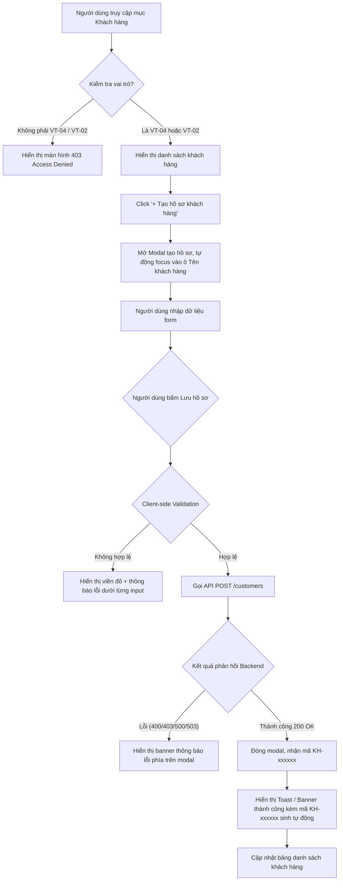

# Thiết kế màn hình: Tạo hồ sơ khách hàng (`NCL-02-CN-001`)

- **Mã công việc**: `NCL-02-CN-001-CV-02`
- **Loại**: `FE-UI`
- **Tên công việc**: Thiết kế màn hình tạo hồ sơ khách hàng
- **Kết quả cần đạt**: Vẽ bố cục, luồng thao tác và thông báo lỗi cho tạo hồ sơ khách hàng

---

## 1. Bố cục tổng thể (Layout Structure)

### 1.1 Màn hình danh sách quản lý khách hàng (`CustomerListPage`)
- **Header**:
  - Breadcrumb: `Trang chủ / Khách hàng / Hồ sơ khách hàng`
  - Tiêu đề trang: `Hồ sơ khách hàng` (kèm mô tả ngắn gọn về chức năng)
  - Nút hành động chính: `+ Tạo hồ sơ khách hàng` (chỉ kích hoạt khi người dùng có vai trò `VT-04` hoặc `VT-02`)
- **Thẻ thống kê nhanh (KPI Metrics)**:
  - *Tổng số khách hàng*: Số lượng khách hàng hiện hữu trong hệ thống.
  - *Khách hàng mới tạo*: Khách hàng vừa được bổ sung thành công trong phiên làm việc.
  - *Quyền hạn thao tác*: Hiển thị vai trò của người dùng (`Nhân viên kinh doanh` / `Quản lý dự án`).
- **Thanh công cụ (Toolbar)**:
  - Ô tìm kiếm nhanh: Lọc theo Tên khách hàng, Mã khách hàng (`KH-xxxxxx`), hoặc Mã số thuế.
  - Bộ lọc ngành nghề / Lĩnh vực.
  - Nút làm mới dữ liệu (Refresh icon).
- **Bảng dữ liệu (Customer Data Table)**:
  - Cột: `Mã KH`, `Tên khách hàng`, `Mã số thuế`, `Ngành nghề/Lĩnh vực`, `Địa chỉ`, `Ngày tạo`, `Thao tác`.
  - Trạng thái trống (Empty State): Minh họa thân thiện khi chưa có dữ liệu hoặc không tìm thấy kết quả phù hợp.

---

## 2. Modal Tạo hồ sơ khách hàng (`CustomerFormModal`)

### 2.1 Cấu trúc Form Modal
- **Tiêu đề Modal**:
  - Icon: 🏢
  - Tiêu đề: `Tạo hồ sơ khách hàng mới`
  - Phụ đề: `Nhập thông tin doanh nghiệp/đối tác. Mã khách hàng (KH-xxxxxx) sẽ được hệ thống cấp tự động sau khi lưu.`
- **Nguyên tắc thiết kế Form**:
  - **Không hiển thị ô nhập mã khách hàng (`code`)** (tuân thủ nguyên tắc hệ thống tự sinh mã duy nhất `KH-xxxxxx` theo backend contract).
  - Đánh dấu rõ ràng trường bắt buộc bằng dấu sao đỏ `*` (`Tên khách hàng *`).
  - Hỗ trợ bộ đếm ký tự thời gian thực (Real-time Character Counter):
    - Tên khách hàng: `x/255`
    - Mã số thuế: `x/50`
    - Lĩnh vực/Ngành nghề: `x/255`
    - Địa chỉ: `x/500`
- **Các trường dữ liệu**:
  1. **Tên khách hàng (`name`)** *(Bắt buộc)*:
     - Placeholder: `Ví dụ: Công ty Cổ phần Công nghệ ABC`
     - Validation: Bắt buộc, không được để trống hoặc chỉ chứa khoảng trắng, tối đa 255 ký tự.
  2. **Mã số thuế (`taxCode`)** *(Tùy chọn)*:
     - Placeholder: `Ví dụ: 0101234567 hoặc 0101234567-001`
     - Validation: Tối đa 50 ký tự, tự động trim khoảng trắng.
  3. **Lĩnh vực / Ngành nghề (`industry`)** *(Tùy chọn)*:
     - Placeholder: `Ví dụ: Công nghệ thông tin, Viễn thông, Tài chính...`
     - Validation: Tối đa 255 ký tự.
  4. **Địa chỉ (`address`)** *(Tùy chọn)*:
     - Component: Textarea gọn gàng (rows=3).
     - Placeholder: `Ví dụ: Tầng 8, Tòa nhà Keangnam, Mễ Trì, Nam Từ Liêm, Hà Nội`
     - Validation: Tối đa 500 ký tự.

---

## 3. Luồng thao tác (Interaction Flow)

---

## 4. Quy chuẩn thông báo lỗi và trạng thái (Feedback & Error States)

| Loại trạng thái | Cách hiển thị | Nội dung thông báo mẫu |
|---|---|---|
| **Lỗi trường bắt buộc** | Viền đỏ quanh input + text đỏ bên dưới | *"Tên khách hàng không được để trống"* |
| **Lỗi vượt quá ký tự** | Viền đỏ quanh input + text cảnh báo độ dài | *"Tên khách hàng không được vượt quá 255 ký tự (hiện có: 260)"* |
| **Lỗi MST quá dài** | Viền đỏ quanh input + text cảnh báo | *"Mã số thuế không được vượt quá 50 ký tự"* |
| **Lỗi quyền hạn (403)** | Banner cảnh báo đỏ nổi bật / Trang Access Denied | *"Bạn không có quyền tạo hồ sơ khách hàng. Chức năng yêu cầu vai trò Nhân viên kinh doanh (VT-04) hoặc Quản lý dự án (VT-02)."* |
| **Lỗi mất kết nối (503)** | Banner cảnh báo mạng | *"Không thể kết nối đến máy chủ Backend. Vui lòng kiểm tra lại dịch vụ."* |
| **Thành công (200)** | Toast xanh lục nổi bật + sao chép nhanh | *"Tạo hồ sơ khách hàng thành công! Mã hồ sơ: KH-xxxxxx"* |
